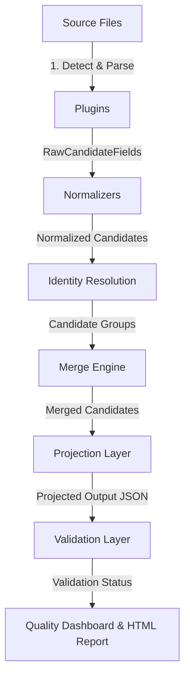

# Demonstration Script & Glossary

This document serves as the guide for presenting the Candidate Data Transformer project. It contains a high-level project overview, a simplified architectural module breakdown, a glossary explaining every key technical term, and a step-by-step demonstration flow with potential reviewer questions and answers.

---

## 1. Project Overview

### The Problem
In modern recruitment, candidate information is scattered across different platforms: applicant tracking systems (ATS), professional networks (LinkedIn), registry CSVs, text resumes, and notes written by recruiters. 

Combining these sources manually is highly error-prone:
* **Format Inconsistency**: Dates use different templates (e.g. `05/06/2021` can be May 6th or June 5th), phone numbers lack country codes, and names are written in varying capitalizations.
* **Information Disagreements**: Sources may disagree on details (e.g., years of experience or titles), making it hard to decide which to trust.
* **Partial Data**: One source may contain only a name and email, while another has a phone number and city. They must be merged without losing context.
* **Explainability Deficit**: Standard database merges silently overwrite fields, leaving reviewers with no record of *why* a particular piece of information was chosen.

### The Solution
This project is an automated pipeline that extracts, normalizes, resolves, merges, and projects candidate records. It provides **deterministic tie-breaking rules**, **probabilistic confidence scores**, and **total decision explainability** via a visual HTML dashboard and structural JSON logs.

---

## 2. Overall Architecture

The system operates as a pipeline where each stage takes the output of the previous stage, processes it, and passes it forward.



### Module Breakdown

#### 1. Source Plugins (`plugins/`)
* **What it does**: Scans input files, detects their formats, and parses their raw key-value pairs into structured signal objects.
* **Why it exists**: Isolates the code that reads specific file types (like CSV, JSON, or text) from the rest of the application.
* **Input**: File paths (`.json`, `.csv`, `.txt`).
* **Output**: A flat list of `RawCandidateField` objects, each with a source tag, evidence tier, raw key, raw value, and timestamp.

#### 2. Normalizers (`normalizers/`)
* **What it does**: Cleans, parses, and translates raw field values into standard canonical representations.
* **Why it exists**: Ensures that values can be compared using exact equality by eliminating formatting noise.
* **Input**: Raw field values and format context.
* **Output**: A `NormalizationResult` containing the cleaned value, normalization confidence, and parsing notes.

#### 3. Identity Resolution (`engine/pipeline.py`)
* **What it does**: Resolves different candidate records from multiple files into unified groups representing single real-world individuals.
* **Why it exists**: Groups records before merging them.
* **Input**: A list of normalized, single-source candidates.
* **Output**: A list of candidate groups (each group contains candidates representing the same person).

#### 4. Merge Engine (`engine/pipeline.py`)
* **What it does**: Combines candidate records within a group into a single canonical candidate profile using deterministic tie-breakers.
* **Why it exists**: Resolves conflicts across sources and computes final confidence scores.
* **Input**: A group of candidates.
* **Output**: A single merged `Candidate` candidate profile carrying all merged fields and a combined list of raw provenances.

#### 5. Projection Layer (`engine/projection.py`)
* **What it does**: Transforms the internal canonical `Candidate` profile into the final client-requested output JSON structure.
* **Why it exists**: Allows different clients to request different output schemas without modifying the underlying database structure.
* **Input**: A merged `Candidate` and a `ProjectionConfig`.
* **Output**: A structured dictionary representing the projected candidate profile.

#### 6. Validation Layer (`engine/validation.py`)
* **What it does**: Audits the projected JSON output for structural issues, type mismatches, and required field omissions.
* **Why it exists**: Alerts the system if projection rules (such as marking name as required) are violated by the merged data.
* **Input**: The projected candidate dictionary and the `ProjectionConfig`.
* **Output**: A `ValidationResult` containing validation pass/fail status and warning logs.

---

## 3. Glossary

#### 1. Plugin
* **What is it?** A modular component designed to extract raw data from a specific file format.
* **Why do we need it?** Keeps source-specific code separate from core logic, making it easy to add new formats (e.g., PDF resumes) later.
* **Where is it used?** In `plugins/`, where individual parsers for CSV, LinkedIn, ATS, and raw resumes reside.

#### 2. Canonical Schema
* **What is it?** The internal standard data model that candidate records are merged into.
* **Why do we need it?** Standardizes candidate attributes across the entire system.
* **Where is it used?** Defined in [`models/candidate.py`](file:///c:/Projects/Multi-Source-Candidate-Data-Transformer/models/candidate.py) (e.g., `Candidate`).

#### 3. Normalization
* **What is it?** The process of translating raw data into a standardized format.
* **Why do we need it?** Allows the merge engine to compare values from different sources using exact equality.
* **Where is it used?** In `normalizers/`, where date, phone, location, name, and skill normalizers are defined.

#### 4. Normalization Confidence
* **What is it?** A score (from `0.0` to `1.0`) indicating the reliability of the normalizer's translation.
* **Why do we need it?** Helps prioritize values (e.g., an unambiguous date has higher confidence than an ambiguous one).
* **Where is it used?** Returned by normalizers and recorded in the decision log.

#### 5. Evidence Tier
* **What is it?** A priority rank (`A`, `B`, `C`, or `D`) assigned to a source based on its reliability.
* **Why do we need it?** Ensures that verified API data (Tier A) wins over recruiter notes (Tier C) or resume guesses (Tier D).
* **Where is it used?** Assigned by plugins and used by the merge engine as the first-level tie-breaker.

#### 6. Evidence Confidence
* **What is it?** The baseline reliability score of a source field before normalization.
* **Why do we need it?** Serves as the starting confidence score for merging.
* **Where is it used?** Set in the plugin and stored in the provenance records.

#### 7. Provenance
* **What is it?** The origin and history log of a candidate's data fields.
* **Why do we need it?** Provides transparency by showing exactly which file, timestamp, and field contributed to the merged profile.
* **Where is it used?** Stored as a list of `ProvenanceRecord` objects on the canonical `Candidate`.

#### 8. Identity Resolution
* **What is it?** The process of matching records across files to identify the same individual.
* **Why do we need it?** Prevents duplicate entries in the final output.
* **Where is it used?** In the pipeline, matching candidates by email or normalized phone number.

#### 9. Weak Signal
* **What is it?** An input field from a low-reliability source (Tier C or D).
* **Why do we need it?** To capture useful data from informal notes while keeping their initial influence low.
* **Where is it used?** During merging, where low-tier sources can corroborate each other.

#### 10. Weak Signal Promotion
* **What is it?** A rule that increases confidence when multiple low-tier sources agree on the same value.
* **Why do we need it?** Boosts confidence when independent sources corroborate each other.
* **Where is it used?** In `_merge_single_field` in `engine/pipeline.py`.

#### 11. Conflict
* **What is it?** A situation where multiple sources claim different values for the same single-valued field.
* **Why do we need it?** Triggers conflict resolution rules to select a winner.
* **Where is it used?** In the merge engine.

#### 12. Conflict Penalty
* **What is it?** A rule that reduces a field's confidence by `10%` if sources contain conflicting values.
* **Why do we need it?** Reflects the disagreement across sources in the final confidence score.
* **Where is it used?** In `_merge_single_field` in `engine/pipeline.py`.

#### 13. Merge
* **What is it?** The process of combining multiple candidate records into a single profile.
* **Why do we need it?** Creates a unified candidate record.
* **Where is it used?** In the merge engine.

#### 14. Complementary Merge
* **What is it?** A merge where missing details in one source are supplied by another without conflict.
* **Why do we need it?** Enriches location fields by merging city, state, and country.
* **Where is it used?** In `_merge_single_field` for the location field in `engine/pipeline.py`.

#### 15. Projection Layer
* **What is it?** A layer that formats the merged `Candidate` into the requested output structure.
* **Why do we need it?** Decouples the internal database schema from the final output format.
* **Where is it used?** In `engine/projection.py`.

#### 16. Validation Layer
* **What is it?** A layer that checks the output of the projection layer against configuration rules.
* **Why do we need it?** Ensures that output profiles meet schema requirements (e.g., checking that required fields are present).
* **Where is it used?** In `engine/validation.py`.

#### 17. Decision Log
* **What is it?** A JSON log documenting the winner, contenders, rules, and reasoning for every field decision.
* **Why do we need it?** Provides transparency by showing exactly how the engine made its decisions.
* **Where is it used?** Written to `outputs/decision_log.json`.

#### 18. Quality Dashboard
* **What is it?** A summary of execution metrics, coverage, and conflict counts.
* **Why do we need it?** Helps administrators monitor the health of the run.
* **Where is it used?** Written to `outputs/quality_dashboard.json`.

#### 19. Configuration-driven Design
* **What is it?** A design pattern where business logic (like phone rules or mappings) is stored in JSON files rather than hardcoded in Python.
* **Why do we need it?** Allows system extensions without modifying source code.
* **Where is it used?** Mappings in `configs/` loaded dynamically.

#### 20. Extra Fields
* **What is it?** A candidate field for storing unmapped or invalid values.
* **Why do we need it?** Preserves raw inputs that failed validation (like incorrect phone numbers) for review.
* **Where is it used?** Stored in `candidate.extra_fields`.

#### 21. Runtime Configuration
* **What is it?** A configuration passed at runtime to control pipeline outputs.
* **Why do we need it?** Customizes output projection behavior per execution.
* **Where is it used?** Passed via the `-c` CLI option.

#### 22. Explainability
* **What is it?** The system's ability to explain its decisions in human-readable language.
* **Why do we need it?** Builds user trust by explaining why data was selected or rejected.
* **Where is it used?** Compiled in the merge engine and rendered in the HTML report.

#### 23. UNRESOLVED_TIE
* **What is it?** A state where two conflicting values share identical evidence tiers, timestamps, and confidence scores.
* **Why do we need it?** Handles cases where no deterministic winner can be chosen.
* **Where is it used?** Sets the field to `None` with `0.15` confidence and logs the tie.

#### 24. Context Guess
* **What is it?** Using context (like location) to infer country code for phone validation.
* **Why do we need it?** Validates local phone numbers that lack country prefixes.
* **Where is it used?** In `_normalize_record` inside `engine/pipeline.py`.

#### 25. Confidence Score
* **What is it?** The score representing the overall reliability of a merged value.
* **Why do we need it?** Helps users gauge the reliability of the data.
* **Where is it used?** Included in the projected output and HTML report.

#### 26. Merge Confidence
* **What is it?** The confidence score computed for a field after merging.
* **Why do we need it?** Incorporates source agreement or conflict penalties.
* **Where is it used?** Stored in `winner_prov.merge_confidence`.

#### 27. Merge Reason
* **What is it?** A description explaining how a field's value was resolved.
* **Why do we need it?** Documents enrichment steps or resolution rules in the decision log.
* **Where is it used?** Stored in `winner_prov.merge_reason`.

#### 28. Source Locking
* **What is it?** Analyzing all dates in a source file to resolve format ambiguity.
* **Why do we need it?** Standardizes dates (e.g. `05/06/2021`) consistently based on other dates in the same file.
* **Where is it used?** In `_analyze_date_formats` inside `engine/pipeline.py`.

#### 29. Deterministic Parsing
* **What is it?** Parsing that produces the same output for a given input.
* **Why do we need it?** Ensures consistent data validation.
* **Where is it used?** In normalizers.

#### 30. E.164
* **What is it?** The international standard format for phone numbers (e.g., `+16175550244`).
* **Why do we need it?** Standardizes phone formats across different countries.
* **Where is it used?** Formatted by `PhoneNormalizer`.

#### 31. ISO-3166
* **What is it?** The international standard for country codes (e.g., `US`, `IN`).
* **Why do we need it?** Standardizes country references across locations.
* **Where is it used?** Used in location mappings and phone rules.

---

## 4. Demo Flow

### Step 1: Run the Pipeline and Tests

First, run the unit and integration test suite to verify code sanity:
```bash
python run_tests.py
```

Next, demonstrate running the CLI pipeline **without a custom configuration file** to showcase the **Default Output** (9 standard fields with confidence wrapping enabled and null output values for missing fields):
```bash
python main.py -i sample_inputs/ats_profile.json sample_inputs/linkedin_profile.json sample_inputs/resume_john_doe.txt sample_inputs/recruiter_candidates.csv sample_inputs/recruiter_notes.txt sample_inputs/malformed_source.json sample_inputs/tie_profile_a.json sample_inputs/tie_profile_b.json -o outputs
```
* **Explain to reviewers**: By omitting `-c`, the pipeline automatically projected standard fields, included confidence scores wrapped in value/confidence dicts, and fell back to `on_missing = "null"`.

Now, run the pipeline **with a custom configuration file** to demonstrate custom projection schema overrides (e.g. mapping `full_name` to `name`, changing missing field behavior, and checking schema validation constraints):
```bash
python main.py -i sample_inputs/ats_profile.json sample_inputs/linkedin_profile.json sample_inputs/resume_john_doe.txt sample_inputs/recruiter_candidates.csv sample_inputs/recruiter_notes.txt sample_inputs/malformed_source.json sample_inputs/tie_profile_a.json sample_inputs/tie_profile_b.json -c configs/sample_projection_config.json -o outputs
```

### Step 2: Show the CLI Validation Failure
Point out the CLI output:
* Notice the `[FAIL] FOUND 1 VALIDATION ERRORS ACROSS BATCH:` warning for candidate `TIE-001`.
* **What to explain**: The pipeline processed all files successfully and wrote all output artifacts. However, because we passed two conflicting profiles (`tie_profile_a.json` and `tie_profile_b.json`) with identical timestamps and tiers, the engine flagged a tie conflict on the `full_name` field. This set the field to `null`, which triggered the validation warning because `name` is marked as required in `configs/sample_projection_config.json`.

### Step 3: Open the HTML Report
Open `outputs/report.html` in a web browser.

#### Run Summary Tab
* Show the metrics cards. Point out **1 Unresolved Tie**, **1 Validation Warning**, and **1 Skipped File** (`malformed_source.json`).
* Show the SVG charts: **Confidence Level per Canonical Field** and **Conflict Resolution Metrics**.

#### Candidate Explorer Tab
* Select **John Doe** from the sidebar:
  * Open **Canonical Profile Summary** to show the merged candidate profile.
  * Open **Source File Contributions** to show that data was gathered from 3 files.
  * Open **Identity Resolution Linkages** to show how John Doe was resolved using his email address.
  * Open **Field Decision Timeline**:
    * Expand **LOCATION**. Show the step trace:
      * ATS JSON: `Springfield` (Tier A)
      * LinkedIn: `Springfield, IL, US` (Tier A)
      * Resume: `Springfield` (Tier A)
      * Show the **Enrichment Reason**: LinkedIn contributed `state='IL'` and `country='US'` to the winner, updating the canonical location to `Springfield, IL, US`.
      * Show that no conflict penalty was applied because the sources corroborated each other.
  * Open **Extra / Unmapped & Ignored Fields**:
    * Point out the two invalid phone entries (`6175550244` and `555-0244`) from `resume_john_doe.txt`.
    * **What to explain**: Since the resume lacked a country prefix and the location was ambiguous, the engine did not assume the country. It marked the numbers as invalid and routed them to the extra fields log.
* Select **John Tie** from the sidebar:
  * Point out the **AVG CONFIDENCE: 15%** warning.
  * Open **Field Decision Timeline**:
    * Expand **FULL_NAME**.
    * Point out that the final value is `null`.
    * Review the **Resolution Rule & Reason**: Show the detailed trace explaining that `John Tie A` and `John Tie B` had identical tiers, timestamps, and confidence scores, resulting in an unresolved tie conflict.
  * Open **Validation Status Alerts**:
    * Show the warning: `Required projected field 'name' is missing or null.`

---

## 5. Potential Reviewer Q&A

#### Q: How does the system handle a phone number if no country is specified?
* **A**: The system checks if the number begins with a known dialing code (like `+1` or `+91`). If it does, the country is inferred. If it does not, the system checks for location fields in the same source file. If a location is found and matches a country, that country is used. Otherwise, the number is treated as unresolvable, returned as `None`, and routed to `extra_fields`. We do not default to US to avoid incorrect assumptions.

#### Q: What happens to the original source data when locations are enriched?
* **A**: The original source data is preserved. The provenance records (`candidates_considered`) in the decision log remain immutable, while the candidate's canonical profile is updated with the enriched values.

#### Q: How does the system handle date format ambiguity?
* **A**: It uses **Source Format Locking**. When a file contains ambiguous dates (like `05/06/2021`), the engine scans all dates in that file. If it finds an unambiguous date (like `25/12/2022`), it locks the format for that file. If no format can be locked, it defaults to `MM/DD/YYYY` and drops the confidence score to `0.40`.
